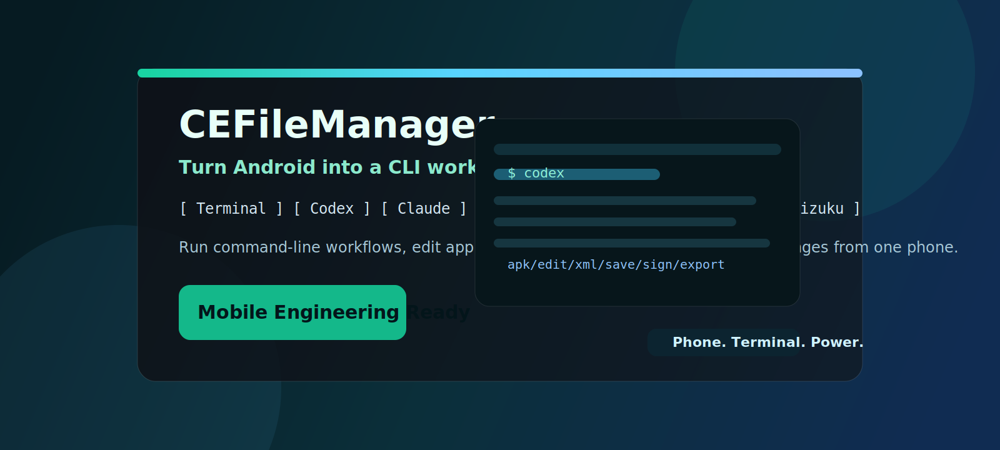
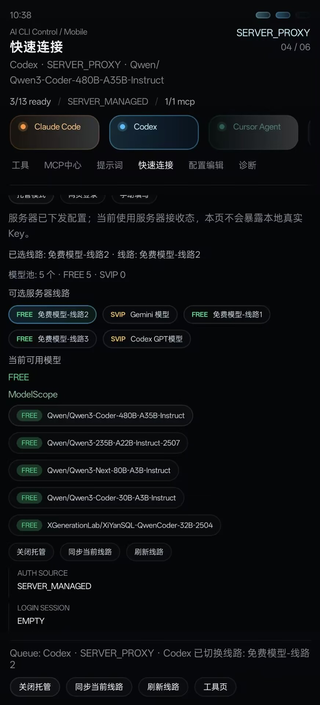
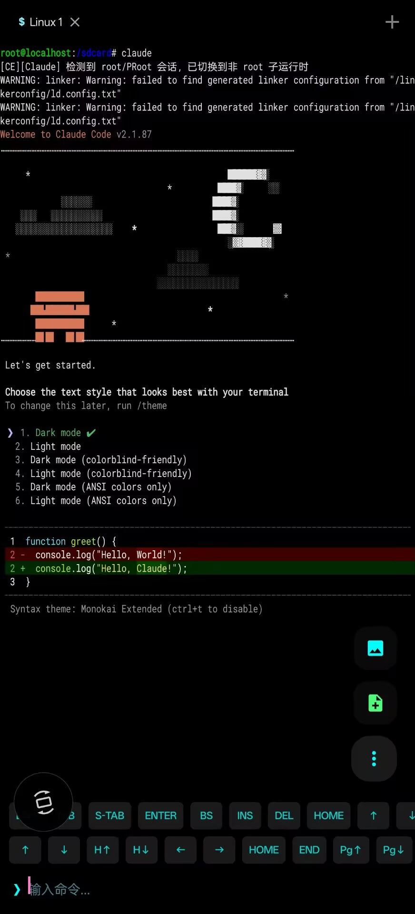
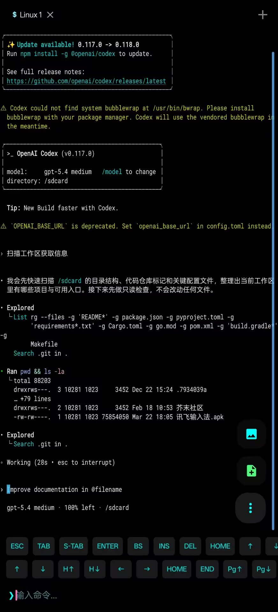

  
  <h1>CEFileManager</h1>
  
<strong>Android, upgraded into a real AI CLI workstation, APK lab, and deep file toolkit.</strong>

  
<strong>把 Android 直接升级成真正的 AI CLI 工作站、APK 实验室和深度文件工具箱。</strong>

  

    <code>12 Integrated CLI Tools</code>
    <code>Free + Managed Models</code>
    <code>APK / XML / DEX / SO</code>
    <code>Root / Shizuku / SAF</code>
  

  

    
    
    
    
  

  
<strong>Download:</strong> <a href="https://daw111.asia/CEFileManager.apk">https://daw111.asia/CEFileManager.apk</a>

  

  <strong>Mobile terminal. AI CLI. Online models. APK editing. Deep file access.</strong> 
  <strong>移动终端、AI CLI、在线模型、APK 编辑、深度文件访问，一体化完成。</strong>

## Why CEFileManager | 为什么是 CEFileManager

- Real terminal workflows directly on Android
- 12 integrated CLI tools instead of just one or two
- Online model access with free lines and managed model catalogs
- APK, XML, DEX, SO, archive, and binary workflows in one app
- Root, Shizuku, SAF, internal storage, and restricted-path handling
- File manager, editor, terminal, signing, and export in one workspace

## CN | 核心定位

**CEFileManager** 不是普通文件浏览器，而是面向高阶 Android 用户的移动工程工作站。  
它把终端、AI CLI、在线模型、文件工程、APK 修改、逆向工具和深度存储访问整合到同一个 App 里，让手机真正具备可连续作业的能力。

## EN | Core Positioning

**CEFileManager** is not just a file browser.  
It is a mobile engineering workstation for advanced Android users, combining terminal workflows, AI CLI access, online models, package editing, reverse-oriented tools, and deep storage access in one app.

## AI CLI Matrix | AI CLI 矩阵

The app integrates these CLI tools in the mobile workspace:

- `Claude Code`
- `Codex CLI`
- `GitHub Copilot`
- `Kiro`
- `Trae`
- `CodeBuddy`
- `Gemini CLI`
- `Qwen CLI`
- `Kimi CLI`
- `OpenCode`
- `iFlow`
- `CE-cli`

Supported access modes include:

- direct API key configuration
- OAuth based login for supported tools
- server-managed proxy sessions
- managed model profiles delivered to the app runtime

## Online Models | 在线模型

CEFileManager supports online model access beyond local CLI startup.

- server-managed model catalogs with `FREE` and advanced tiers
- mobile-side selection and switching of available model profiles
- support for OpenAI-compatible, Anthropic-compatible, Google, Qwen, DeepSeek, OpenRouter, and other routed upstream configurations
- free-line and hosted-line usage depending on real-time server distribution and current account availability

This means the app is not limited to a single built-in model path. It can serve as a mobile entry point for multiple online model workflows.

## Runtime & Dependencies | 运行时与依赖

CEFileManager includes a mobile-oriented execution environment for CLI usage:

- embedded Linux runtime for terminal and CLI execution
- Node.js / npm based CLI installation flow
- support for npm mirrors and runtime environment synchronization
- managed configuration delivery for CLI auth and model setup
- MCP related workflow support
- local loopback proxy path for managed CLI routing

## Reverse & Package Toolkit | 逆向与包体工具

- APK open, edit, repack, sign, and export
- XML editing and package resource workflows
- DEX-oriented analysis and modification flows
- SO / ELF analysis and binary-oriented tooling
- archive browsing and virtual archive operations
- hex viewing, hash checking, and structured package inspection

The codebase also includes integration around `Jadx`, `Baksmali`, native analysis utilities, and package signing flows.

## File Engineering | 文件工程能力

- browse, copy, move, replace, compare, preview, and batch process files
- work with normal storage, internal storage, SAF paths, and restricted directories
- handle text, image, video, PDF, hex, and archive-oriented viewing flows
- LAN and network-oriented transfer capabilities including HTTP / FTP / SFTP related workflows
- continuous work across file manager, editor, terminal, and export pipeline

## Screenshots | 实机截图

  
  
  

  Quick Connect · Claude Code on Phone · Codex on Phone

## Feature Highlights | 核心能力

| Module | Highlights |
| --- | --- |
| Terminal | Shell workflow, long output handling, command execution |
| AI CLI | 12 integrated CLI tools inside the mobile workspace |
| Online Models | Free-line and managed model catalogs with multi-upstream routing |
| File Manager | Browse, copy, move, replace, compare, preview, and batch operations |
| Editors | Text editing, XML editing, search, and syntax highlighting |
| APK Lab | Open internals, edit contents, repack, sign, and export |
| Binary Tools | Hex viewing, hash checks, archive handling, reverse utilities |
| Access Layers | Root, Shizuku, SAF, internal storage, and restricted-path workflows |

## Built For | 适合场景

- advanced Android file management
- mobile AI CLI workflows
- online model usage on phone
- APK modification, repacking, signing, and export
- XML, text, and binary viewing or editing
- Root / Shizuku based deep file operations
- real work on the go with only a phone

## Download | 下载

- APK: [https://daw111.asia/CEFileManager.apk](https://daw111.asia/CEFileManager.apk)
- Repository: [https://github.com/XiangSu-ce/CEFileManager](https://github.com/XiangSu-ce/CEFileManager)
- Issues: [https://github.com/XiangSu-ce/CEFileManager/issues](https://github.com/XiangSu-ce/CEFileManager/issues)
- QQ Group: [https://qm.qq.com/q/7wjFGXwBXy](https://qm.qq.com/q/7wjFGXwBXy)

## One-Line Pitch | 一句话宣传

`Turn Android into a real mobile engineering workstation.`

`让 Android 手机直接变成真正的移动工程工作站。`
